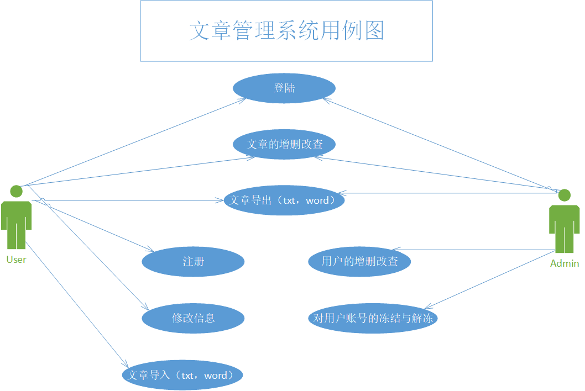
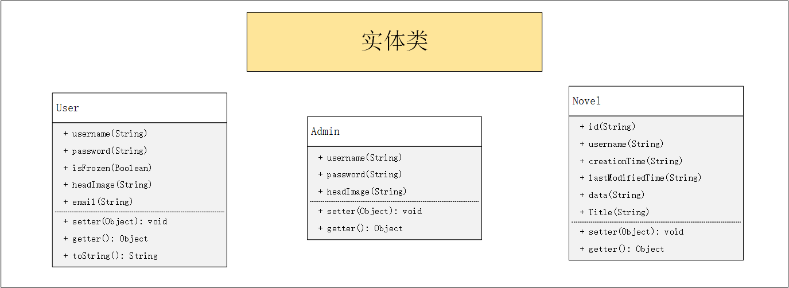
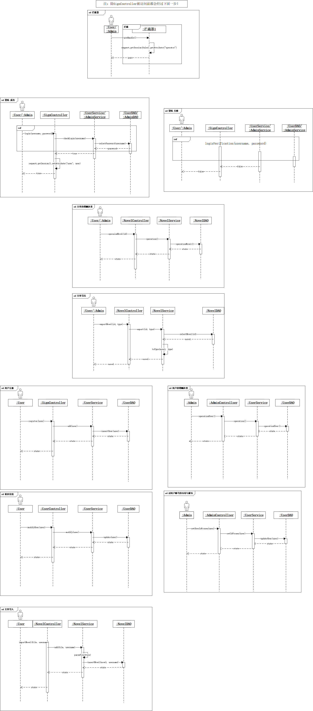

### 一、前端项目源代码
vue项目源代码 [NovelManagementSystem-vue](https://github.com/FightingFZC/NovelManagementSystem-vue)
需要运行的话要使用mysql，数据库名为nms，导入nms.sql来创建三个表。
默认管理员：
   账号：a1
   密码：a1
### 二、文章管理系统 需求分析

1. 用户

   1. 登陆
   2. 注册
   3. 上传文章，以txt，word（，md）的形式上传
   4. 在线编辑
   5. 下载上传的文章
   6. 对自己上传文章的**增删改查**
2. 管理员

   1. 登陆
   2. 用户管理
      - 对用户的**增删改查**
      - 对用户账号的**冻结**与**解冻**
   3. 文章管理
      - 对用户文章的**增删改查**

### 三、文章管理系统 设计

#### 3.1 数据库（nms）设计

1. user
   1. username(primary key)
   2. password
   3. headImage
   4. isFrozen(default: false)
   5. email
2. admin
   1. username(primary key)
   2. password
   3. headImage
3. novel
   1. id(primary key)
   2. username(foreign key)
   3. creationTime
   4. lastModifiedTime
   5. data
   6. title

#### 3.2 实体类

#### 3.3 方法详解

